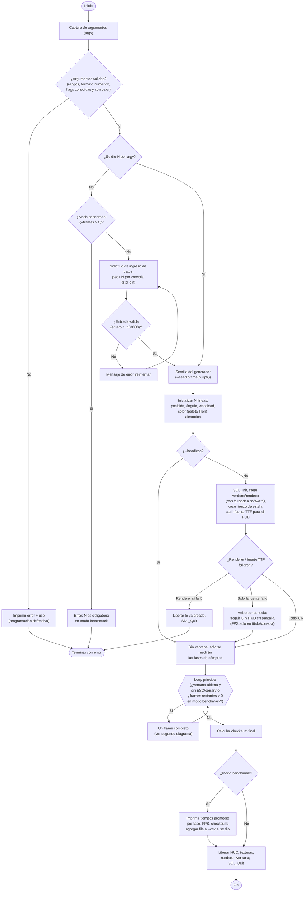

# Anexo 1 — Diagrama de flujo del programa

Cubre ambos ejecutables (`secuencial.exe` y `paralelo.exe`): comparten exactamente
la misma estructura general; lo único que cambia es cómo se recorre el arreglo de
líneas dentro de las fases 1 y 2 (ver el segundo diagrama).

## 1. Flujo general (arranque, loop principal, cierre)

## 2. Un frame (fases 1, 2 y 3)

```mermaid
flowchart TD
    A(["Inicio de frame"]) --> B["Sondear eventos SDL<br/>(SDL_QUIT, tecla ESC)"]
    B --> C["Calcular dt<br/>(reloj real, o 1/60 fijo<br/>en modo benchmark)"]
    C --> D["FASE 1 — Movimiento<br/>(secciones paralelas: v2/v3/v4<br/>usan #pragma omp parallel for;<br/>v1 usa un for común)"]
    D --> D1["Por cada línea (independiente):<br/>integrar posición,<br/>rebotar en bordes<br/>(solo si aún va hacia la pared),<br/>recalcular ángulo/extremos/AABB"]
    D1 --> E{{"Barrera implícita<br/>(fin de omp for / omp parallel)"}}
    E --> F["FASE 2 — Detección de choques<br/>(solo lectura sobre las líneas)"]
    F --> F1["v1/v2: doble for secuencial<br/>v3/v3-naive: omp for + AABB<br/>v4: grilla espacial, omp for<br/>por celda + vecinas"]
    F1 --> G{"Mecanismo de sincronía<br/>al guardar pares hallados"}
    G -- v3/v4 --> G1["Buffer local por hilo,<br/>luego #pragma omp critical<br/>(fusión, una vez por hilo)"]
    G -- v3-naive --> G2["#pragma omp critical<br/>por cada par hallado"]
    G -- v1/v2 --> G3["Sin sincronía<br/>(un solo hilo)"]
    G1 --> H{{"#pragma omp barrier<br/>(todas las fusiones listas)"}}
    G2 --> H
    G3 --> I
    H --> I["Resolución de choques<br/>(un solo hilo: #pragma omp single<br/>en v3/v3-naive/v4, directo en v1/v2)"]
    I --> I1["Por cada par, en orden (i,j):<br/>si aún se acercan → choque elástico<br/>+ intercambio de color + separación<br/>+ reacomodo a bordes; si no, se ignora"]
    I1 --> J["Actualizar contador de choques,<br/>crear chispas visuales"]
    J --> K["Actualizar FPS (cada 0.5s):<br/>título de ventana, consola, HUD"]
    K --> L{"¿Hay renderer?<br/>(no en modo headless)"}
    L -- No --> P(["Fin de frame"])
    L -- Sí --> M["FASE 3 — Render (SIEMPRE secuencial,<br/>SDL no es thread-safe)"]
    M --> M1["Construir vértices de las líneas<br/>(omp parallel for en v3/v4;<br/>for común en v1/v2)"]
    M1 --> M2["Desvanecer lienzo (estela),<br/>dibujar rejilla, SDL_RenderGeometry<br/>(glow + núcleo), chispas, HUD"]
    M2 --> M3["SDL_RenderPresent"]
    M3 --> P
```

## Notas sobre las secciones marcadas en el diagrama

- **Captura de argumentos**: `parseArgs` en [`src/config.cpp`](../src/config.cpp).
- **Solicitud de ingreso de datos**: bloque `requestNFromConsole` en [`src/config.cpp`](../src/config.cpp), solo cuando N no vino por línea de comandos y no es una corrida de benchmark desatendida.
- **Programación defensiva**: validación de rangos y formato en cada flag (`config.cpp`), manejo de fallos de `SDL_Init`/`SDL_CreateWindow`/`SDL_CreateRenderer`/`TTF_Init`/`TTF_OpenFont` sin abortar el programa cuando es posible seguir sin esa función (el HUD).
- **Secciones paralelas**: Fase 1 (movimiento) y Fase 2 (detección de choques y, en v3/v4, construcción de vértices) en `src/paralelo.cpp`.
- **Mecanismos de sincronía**: `#pragma omp critical`, `#pragma omp barrier`, `#pragma omp single` y `reduction` en `src/paralelo.cpp`; ver también el Anexo 2.
- **Despliegue de resultados**: FPS en título de ventana, consola y HUD en pantalla (SDL2_ttf); en modo benchmark, tiempos por fase, FPS promedio y checksum, impresos y opcionalmente escritos a CSV (`src/bench_io.cpp`).
